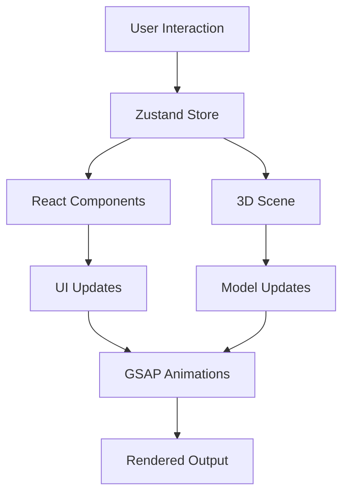

# 🍎 MacBook GSAP 3D Experience

<p align="center">
  
  
  
  
  
  
</p>

<p align="center">
  
</p>

<p align="center">
  <strong>An immersive, production-ready MacBook product showcase</strong><br>
  Featuring interactive 3D models, cinematic animations, and Apple-inspired design excellence
</p>

<p align="center">
  <a href="#-live-demo">Live Demo</a> •
  <a href="#-features">Features</a> •
  <a href="#-installation">Installation</a> •
  <a href="#-documentation">Documentation</a> •
  <a href="#-contributing">Contributing</a>
</p>

---

## 🌟 Live Demo

<p align="center">
  <a href="https://your-demo-link.vercel.app" target="_blank">
    
  </a>
  <a href="https://www.youtube.com/watch?v=your-video" target="_blank">
    
  </a>
  <a href="https://codesandbox.io/s/your-sandbox" target="_blank">
    
  </a>
</p>

---

## 📋 Table of Contents

- [Overview](#-overview)
- [Features](#-features)
- [Tech Stack](#️-tech-stack)
- [Architecture](#-architecture)
- [Installation](#-getting-started)
- [Project Structure](#-project-structure)
- [Core Components](#-core-components)
- [State Management](#-state-management)
- [3D Models & Assets](#-3d-models--assets)
- [Animation System](#-animation-system)
- [Performance Optimization](#-performance-optimization)
- [Customization](#-customization-guide)
- [Troubleshooting](#️-troubleshooting)
- [Best Practices](#-best-practices)
- [Deployment](#-deployment)
- [Browser Support](#-browser-support)
- [Contributing](#-contributing)
- [License](#-license)
- [Changelog](#-changelog)

---

## 🎯 Overview

**MacBook GSAP 3D Experience** is a cutting-edge web application that recreates the premium feel of Apple's product pages. Built with modern web technologies, this project demonstrates advanced techniques in 3D rendering, animation, and interactive design.

### **Why This Project?**

- 🎓 **Educational:** Perfect for learning React Three Fiber, GSAP, and 3D web development
- 💼 **Portfolio-Ready:** Showcase your skills with a production-quality project
- 🔧 **Extensible:** Clean architecture makes it easy to add features or adapt for other products
- 🚀 **Performance-First:** Optimized for smooth 60fps animations across devices

### **Use Cases**

- E-commerce product showcases
- Portfolio websites for designers/developers
- Marketing campaigns and landing pages
- Interactive product configurators
- Educational demonstrations of 3D web tech

---

## ✨ Features

<table>
  <tr>
    <td width="50%">
      
### 🎨 **Visual & Design**
- ✅ Pixel-perfect Apple-inspired UI
- ✅ Smooth micro-interactions
- ✅ Custom typography (SF Pro)
- ✅ Dark mode support
- ✅ Glass morphism effects
- ✅ Responsive grid layouts

    </td>
    <td width="50%">
      
### 🖥️ **3D Experience**
- ✅ High-quality GLB models
- ✅ Real-time model switching
- ✅ Studio-grade lighting
- ✅ Material customization
- ✅ Dynamic shadows
- ✅ Reflection mapping

    </td>
  </tr>
  <tr>
    <td width="50%">
      
### 🎬 **Animations**
- ✅ GSAP ScrollTrigger integration
- ✅ Parallax scrolling effects
- ✅ Stagger animations
- ✅ Page transitions
- ✅ Easing customization
- ✅ Timeline orchestration

    </td>
    <td width="50%">
      
### ⚡ **Performance**
- ✅ Code splitting
- ✅ Lazy loading assets
- ✅ Optimized textures
- ✅ FPS monitoring
- ✅ Memory management
- ✅ Progressive enhancement

    </td>
  </tr>
  <tr>
    <td width="50%">
      
### 📱 **Responsive**
- ✅ Mobile-first approach
- ✅ Touch gestures
- ✅ Adaptive layouts
- ✅ Performance scaling
- ✅ Cross-browser tested
- ✅ Tablet optimization

    </td>
    <td width="50%">
      
### 🔧 **Developer Experience**
- ✅ TypeScript ready
- ✅ Hot Module Replacement
- ✅ ESLint + Prettier
- ✅ Component documentation
- ✅ Debugging tools
- ✅ Clear code comments

    </td>
  </tr>
</table>

---

## 🛠️ Tech Stack

### **Frontend Framework**
```
React 18.2.0+          → UI library with concurrent features
React DOM 18.2.0+      → React renderer for web
```

### **Build Tools**
```
Vite 5.0+              → Next-gen build tool (ES modules, HMR)
@vitejs/plugin-react   → Official React plugin for Vite
```

### **3D Graphics**
```
Three.js ^0.160.0      → WebGL 3D library
@react-three/fiber     → React renderer for Three.js
@react-three/drei      → Useful helpers (OrbitControls, useGLTF, etc.)
@react-three/postprocessing → Post-processing effects
```

### **Animation**
```
GSAP 3.12+             → Professional animation library
gsap/ScrollTrigger     → Scroll-based animations
gsap/ScrollSmoother    → Smooth scrolling (optional)
```

### **State Management**
```
Zustand 4.4+           → Lightweight state management
```

### **Utilities**
```
clsx                   → Conditional className utility
react-responsive       → Media query hooks
leva                   → GUI controls for debugging (dev only)
```

### **Development**
```
ESLint                 → JavaScript linting
Prettier               → Code formatting
Husky                  → Git hooks
lint-staged            → Run linters on staged files
```

---

## 🏗️ Architecture

### **Component Hierarchy**

```
App
├── Navbar
├── Showcase (Hero Section)
│   └── ProductViewer
│       ├── Canvas (R3F)
│       │   ├── StudioLights
│       │   ├── ModelSwitcher
│       │   │   ├── Macbook14
│       │   │   └── Macbook16
│       │   ├── Environment
│       │   └── Effects
│       └── Controls (OrbitControls)
├── Features (Scroll Section)
│   ├── FeatureCard (x4)
│   └── ScrollAnimation
├── Highlights
│   ├── VideoCarousel
│   └── SpecList
├── Performance
│   ├── ChipAnimation
│   └── BenchmarkChart
└── Footer
```

### **Data Flow**



### **File Organization Strategy**

```
📦 Atomic Design Pattern
├── 🔹 Atoms (Buttons, Inputs)
├── 🔸 Molecules (Cards, NavItems)
├── 🔶 Organisms (Navbar, ProductViewer)
├── 📄 Templates (PageLayout)
└── 📱 Pages (App.jsx)
```
---

## 📁 Project Structure

```
macbook-gsap-app/
│
├── 📂 public/                          # Static assets (served as-is)
│   ├── 📂 models/                      # 3D models
│   │   ├── macbook.glb                 # Base MacBook model
│   │   ├── macbook-14.glb              # 14-inch variant
│   │   └── macbook-16.glb              # 16-inch variant
│   ├── 📂 fonts/                       # Web fonts
│   │   ├── SF-Pro-Display-Regular.woff2
│   │   └── SF-Pro-Display-Bold.woff2
│   ├── 📂 videos/                      # Video textures
│   │   ├── hero.mp4
│   │   └── features/
│   ├── 📂 textures/                    # Image textures
│   │   ├── env-map.hdr
│   │   └── matcap.png
│   └── favicon.svg
│
├── 📂 src/
│   ├── 📂 assets/                      # Imported assets
│   │   ├── 📂 images/
│   │   │   ├── hero-bg.jpg
│   │   │   └── chip-m3.png
│   │   └── 📂 icons/
│   │       └── apple-logo.svg
│   │
│   ├── 📂 components/
│   │   ├── 📂 models/                  # 3D Model Components
│   │   │   ├── Macbook.jsx             # Generic MacBook wrapper
│   │   │   ├── Macbook14.jsx           # 14" model component
│   │   │   ├── Macbook16.jsx           # 16" model component
│   │   │   └── index.js                # Barrel exports
│   │   │
│   │   ├── 📂 three/                   # Three.js Components
│   │   │   ├── ModelSwitcher.jsx       # Handles model transitions
│   │   │   ├── StudioLights.jsx        # Lighting setup
│   │   │   ├── ProductViewer.jsx       # Main 3D canvas
│   │   │   ├── Environment.jsx         # HDR environment
│   │   │   ├── Effects.jsx             # Post-processing
│   │   │   └── CameraController.jsx    # Camera animations
│   │   │
│   │   ├── 📂 sections/                # Page Sections
│   │   │   ├── Showcase.jsx            # Hero section
│   │   │   ├── Features.jsx            # Scrolling features
│   │   │   ├── Highlights.jsx          # Video highlights
│   │   │   ├── Performance.jsx         # Specs & benchmarks
│   │   │   └── Compare.jsx             # Model comparison
│   │   │
│   │   ├── 📂 ui/                      # Reusable UI Components
│   │   │   ├── Button.jsx
│   │   │   ├── Card.jsx
│   │   │   ├── Loader.jsx
│   │   │   ├── VideoCarousel.jsx
│   │   │   └── index.js
│   │   │
│   │   ├── Navbar.jsx                  # Navigation header
│   │   └── Footer.jsx                  # Footer component
│   │
│   ├── 📂 hooks/                       # Custom React Hooks
│   │   ├── useMediaQuery.js            # Responsive breakpoints
│   │   ├── useScrollAnimation.js       # GSAP scroll helpers
│   │   ├── useModelLoader.js           # GLB loading with progress
│   │   └── usePerformanceMonitor.js    # FPS tracking
│   │
│   ├── 📂 store/                       # State Management
│   │   ├── index.js                    # Zustand store
│   │   └── slices/                     # Store slices
│   │       ├── modelSlice.js
│   │       └── uiSlice.js
│   │
│   ├── 📂 constants/                   # App Constants
│   │   ├── index.js                    # Main constants
│   │   ├── colors.js                   # Color palette
│   │   ├── sizes.js                    # MacBook sizes
│   │   └── animations.js               # Animation configs
│   │
│   ├── 📂 utils/                       # Utility Functions
│   │   ├── performanceOptimizations.js
│   │   ├── textureLoader.js
│   │   └── analytics.js
│   │
│   ├── 📂 styles/                      # Global Styles
│   │   ├── index.css                   # Main stylesheet
│   │   ├── reset.css                   # CSS reset
│   │   └── variables.css               # CSS variables
│   │
│   ├── App.jsx                         # Root component
│   ├── main.jsx                        # Entry point
│   └── vite-env.d.ts                   # Vite types
│
├── 📂 docs/                            # Documentation
│   ├── API.md                          # Component API docs
│   ├── ANIMATIONS.md                   # Animation guide
│   └── DEPLOYMENT.md                   # Deployment guide
│
├── 📂 scripts/                         # Build scripts
│   ├── optimize-models.js              # GLB optimization
│   └── generate-thumbnails.js          # Video thumbnails
│
├── .eslintrc.cjs                       # ESLint config
├── .prettierrc                         # Prettier config
├── .gitignore
├── package.json
├── vite.config.js                      # Vite configuration
├── tailwind.config.js                  # Tailwind CSS config
└── README.md
```

---

## 📦 3D Models & Assets

### **Model Requirements**

**Format Specifications:**
- **File Type:** `.glb` (Binary GLTF)
- **Max File Size:** 15MB (compressed)
- **Polygon Count:** < 100K triangles
- **Texture Resolution:** 2048x2048 (max)

**Recommended Tools:**
- **Blender** - Free 3D modeling software
- **gltf-pipeline** - Model optimization CLI
- **Draco** - Mesh compression

---

### **Model Optimization Workflow**

#### **1. Export from Blender**
```
File → Export → glTF 2.0 (.glb/.gltf)

Settings:
☑ Remember Export Settings
☑ Apply Modifiers
☑ Compression: Draco (level 10)
☑ Export: Visible Objects
☐ Export Cameras
☐ Export Lights
```

#### **2. CLI Optimization**
```bash
# Install gltf-pipeline
npm install -g gltf-pipeline

# Optimize model
gltf-pipeline -i macbook-raw.glb -o macbook.glb -d

# Check file size
ls -lh public/models/
```

#### **3. Texture Optimization**
```bash
# Install sharp (image processing)
npm install sharp

# Compress textures
node scripts/optimize-textures.js
```


### **Asset Organization**

```
public/
├── models/
│   ├── macbook-14.glb          (5.2 MB)
│   └── macbook-16.glb          (5.8 MB)
│
├── textures/
│   ├── env-map.hdr             (2.1 MB)
│   ├── matcap.png              (256 KB)
│   └── normal-map.jpg          (512 KB)
│
└── videos/
    ├── hero.mp4                (8.5 MB, H.264)
    ├── feature-1.mp4           (3.2 MB)
    └── feature-2.mp4           (3.8 MB)
```

**Video Compression:**
```bash
# Using FFmpeg
ffmpeg -i input.mp4 \
  -c:v libx264 \
  -crf 28 \
  -preset slow \
  -c:a aac \
  -b:a 128k \
  output.mp4
```

---

## 🎬 Animation System

### **GSAP ScrollTrigger Patterns**

#### **1. Pin Section with Rotation**
```javascript
gsap.to(modelRef.current.rotation, {
  y: Math.PI * 2,
  scrollTrigger: {
    trigger: sectionRef.current,
    start: 'top top',
    end: 'bottom bottom',
    scrub: 1,
    pin: true,
    anticipatePin: 1
  }
});
```


## 📚 Best Practices

### **React Three Fiber**

1. **Always use `useFrame` for animations:**
   ```javascript
   useFrame((state, delta) => {
     ref.current.rotation.y += delta;
   });
   ```

2. **Memoize geometry and materials:**
   ```javascript
   const geometry = useMemo(() => new THREE.BoxGeometry(), []);
   const material = useMemo(() => new THREE.MeshStandardMaterial(), []);
   ```

3. **Clean up on unmount:**
   ```javascript
   useEffect(() => {
     return () => {
       geometry.dispose();
       material.dispose();
       texture.dispose();
     };
   }, []);
   ```

---


## 🌐 Browser Support

| Browser | Version | Support |
|---------|---------|---------|
| Chrome | 90+ | ✅ Full |
| Firefox | 88+ | ✅ Full |
| Safari | 14+ | ✅ Full |
| Edge | 90+ | ✅ Full |
| Mobile Safari | iOS 14+ | ✅ Full |
| Chrome Android | Latest | ✅ Full |

**Required Features:**
- WebGL 2.0
- ES6 Modules
- CSS Grid
- CSS Custom Properties
- IntersectionObserver API

**Polyfills:** Not required for modern browsers

---


## 📝 Changelog

### **v1.0.0** (2024-02-03)
- 🎉 Initial release
- ✨ 14" & 16" MacBook models
- 🎬 GSAP ScrollTrigger animations
- 💡 Studio lighting setup
- 📱 Fully responsive design

### **v0.9.0** (2024-01-20)
- 🔧 Beta release
- 🐛 Bug fixes and optimizations

[View Full Changelog](CHANGELOG.md)

---

## 🙏 Acknowledgments

### **Inspiration**
- [Apple](https://www.apple.com/) - Product page design excellence
- [awwwards](https://www.awwwards.com/) - Creative web design showcase
- [Codrops](https://tympanus.net/codrops/) - Innovative web experiments

### **3D Assets**
- **MacBook Model:** [Jack Baeten](https://sketchfab.com/jack.baeten) on Sketchfab
- **HDR Maps:** [Poly Haven](https://polyhaven.com/)

### **Libraries & Tools**
- [Three.js](https://threejs.org/) by Ricardo Cabello (Mr.doob)
- [GSAP](https://greensock.com/) by GreenSock
- [React Three Fiber](https://github.com/pmndrs/react-three-fiber) by Poimandres
- [Zustand](https://github.com/pmndrs/zustand) by Poimandres

### **Learning Resources**
- [Three.js Journey](https://threejs-journey.com/) by Bruno Simon
- [React Three Fiber Docs](https://docs.pmnd.rs/react-three-fiber/)
- [GSAP ScrollTrigger Docs](https://greensock.com/docs/v3/Plugins/ScrollTrigger)

---


## ⭐ Show Your Support

If this project helped you, please consider:

- ⭐ **Starring the repository**
- 🐦 **Sharing on Twitter**
- 📝 **Writing a blog post**
- 💼 **Using in your portfolio**

---


<p align="center">
  <sub>Built with ❤️ and ☕ by <a href="https://github.com/your-username">Your Name</a></sub><br>
  <sub>⭐ Star this repo if you found it helpful!</sub>
</p>

<p align="center">
  <a href="#-macbook-gsap-3d-experience">Back to Top ↑</a>
</p>
